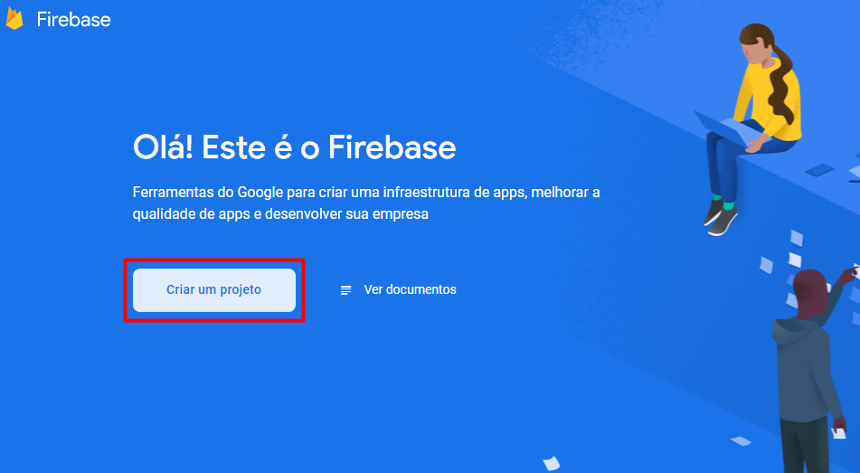

A decisão de fazer este artigo/tutorial foi para ajudar as pessoas que, assim como eu, estão começando e que qualquer conteúdo ou resposta do Stack Overflow pode ajudar.\
\
Sei também que, nestes casos, você já pode estar começando a fazer este projeto e só precisa entender porque seu código não funciona ou como implementar de uma maneira diferente, então para isto, deixo aqui já o repositório deste tutorial:

Então, vamos lá:

### Assuntos que serão abordados:

* [Criação e configuração de conta no Firebase](#1.-Criação-e-configuração-de-conta-no-Firebase);
* Começando um novo projeto Expo;
* Configurando acesso as telas de Login e Home;

### 1. Criação e configuração de conta no Firebase;

Para criar uma conta no Firebase, será necessário acessar o site <https://firebase.google.com/> e criar ou logar com sua conta do Google. 
Após ter criado a conta, você entrará em uma tela solicitando que crie um novo projeto:



Sendo assim, **1.** dê um nome ao seu projeto, pode ser qualquer, **2.** pode deixar ativado a opção de Analytics caso queira, não iremos mexer nela, e por fim, **3.** aceite os termos.


Feito isso, você entrará em um tela para escolher qual plataforma deseja criar o projeto. Escolha a plataforma **'Web'** para conseguir as **configurações do Firebase** para posteriormente colocar no React Native:


Na segunda etapa 'Adicionar SDK do Firebase' irá conter a informação importante para nós aqui, o objeto `firebaseConfig`:

```javascript
var firebaseConfig = {
  apiKey: "your-apiKey",
  authDomain: "your-authDomain",
  projectId: "your-projectId",
  storageBucket: "your-storageBucket",
  messagingSenderId: "your-messagingSenderId",
  appId: "your-appId",
  measurementId: "your-measurementId"
};
```

Copie o seu `firebaseConfig` e pode clicar em 'Continuar no console'.\
\
Só falta mais uma coisa, habilitar a autenticação por e-mail e senha no Console do Firebase. Acesse o menu lateral > Authentication > E-mail/senha > 'Editar' > Ative a primeira opção.


Com isto, com o objeto `firebaseConfig` e habilitado a autenticação por e-mail e senha, podemos dar inicio ao código do React Native de fato.

### 2. Começando um novo projeto Expo:

Este tutorial tem foco no desenvolvimento com React Native utilizando a biblioteca Expo. Por isto, as instalações de pacotes e dependências serão com o `expo`.

Primeiro, instale o Expo CLI de forma global para poder iniciar um novo projeto-template dele e crie um novo projeto:

```shell
# Instalando a CLI para poder criar novo projeto
npm install --global expo-cli

# Criar um novo projeto 'my-project', selecione o template "blank" quando questionado
expo init my-project

# Ou, para criar um projeto na pasta em que está o CMD:
expo init .
```

Caso haja alguma dúvida do processo ou como funciona o Expo, sempre [consulte a documentação](https://docs.expo.io/).

Segundo, instale o [React Navigation utilizando o Expo](https://reactnavigation.org/docs/getting-started#installing-dependencies-into-an-expo-managed-project) para obter as versões suportadas para o framework:

```shell
expo install react-native-gesture-handler react-native-reanimated react-native-screens react-native-safe-area-context @react-native-community/masked-view
```

Agora, instale o Firebase utilizando o NPM:

```shell
npm install firebase
```

Com isto, terá um projeto Expo/React Native pronto para receber suporte a autenticação e telas mapeadas para Login, Cadastro e Home.

### 3. Adicionando suporte as telas:

Para começar, crie uma pasta, dentro da raiz do projeto, chamada **/screens** com 3 arquivos dentro dela: **LoginScreen.js**, **SignupScreen.js** e **HomeScreen.js**. Crie um componente funcional em cada um destes arquivos seguindo o exemplo para a tela de Login (LoginScreen.js):

```jsx
import React from 'react';
import { View, Text, StyleSheet } from 'react-native';

export default function LoginScreen() {
  return (
    <View style={styles.container}>
      <Text>Tela de Login (Login)</Text>
    </View>
  )
}

const styles = StyleSheet.create({
  container: {
    flex: 1,
    backgroundColor: '#fff',
    alignItems: 'center',
    justifyContent: 'center',
  },
})
```

Ótimo, temos as telas prontas para receberem lógica, interface e as rotas posteriormente!

Vamos seguir criando uma pasta, também na raiz do projeto, chamada **/navigation**, com 3 arquivos dentro: **AuthStack.js**, **HomeStack.js** e **Routes.js**. 

Explicando o que faremos com estas 'stacks' e a 'rota', é simples, o React Navigation nos dá a possibilidade de limitar o acesso de um usuário à determinada tela. Para isto, o que precisamos fazer é separar o acesso em 2, um antes de logar, sendo possível acessar somente as telas de Login e Signup, e o outro para o restante da aplicação, neste caso, a tela Home. E essa separação é feita com a criação de diferentes 'Stacks' (que nada mais são do que agrupamentos de telas). Com o usuário dentro de uma dessas stacks, ele poderá navegar entre as telas, passar valores entre elas e etc... Para entender melhor como isto funciona na teoria e prática, recomendo a leitura da [documentação, muito bem escrita, do React Navigation](https://reactnavigation.org/docs/hello-react-navigation).

Edite o arquivo '**HomeStack.js**':

```jsx
import React from 'react';
import { createStackNavigator } from '@react-navigation/stack';
import HomeScreen from '../screens/HomeScreen';

const Stack = createStackNavigator();

export default function HomeStack() {
  return (
    <Stack.Navigator>
      <Stack.Screen name='Home' component={HomeScreen} options={{title: 'Tela inicial'}} />
      {/* Aqui poderia ter mais telas, por exemplo, para criar postagens, visualizar perfil, configurações... */}
    </Stack.Navigator>
  );
}
```

Agora, o arquivo '**AuthStack.js**':

```jsx
import React from 'react';
import { createStackNavigator } from '@react-navigation/stack';
import LoginScreen from '../screens/LoginScreen';
import SignupScreen from '../screens/SignupScreen';

const Stack = createStackNavigator();

export default function AuthStack() {
  return (
    <Stack.Navigator>
      <Stack.Screen name='Login' component={LoginScreen} options={{title: 'Login'}} />
      <Stack.Screen name='Signup' component={SignupScreen} options={{title: 'Cadastrar-se'}} />
    </Stack.Navigator>
  );
}
```

Perfeito, temos nossos agrupamentos de telas, ou melhor, stacks, já definidas. Porém, ainda não estão conectadas, e é para isto que servirá o Routes. Poderíamos fazer a conexão entre eles agora para ver de fato isto funcionando, porém, vamos configurar primeiro o Firebase.

Crie uma pasta **/database** (na raiz, como sempre) e um arquivo dentro dela chamado **firebase.js**. Edite-o e coloque suas configurações dentro dele como abaixo, com o objeto `firebaseConfig`  obtido anteriormente na criação da conta do Firebase:

```javascript
import firebase from 'firebase';

import 'firebase/firestore';

const firebaseConfig = {
  apiKey: "your-apiKey",
  authDomain: "your-authDomain",
  projectId: "your-projectId",
  storageBucket: "your-storageBucket",
  messagingSenderId: "your-messagingSenderId",
  appId: "your-appId",
  measurementId: "your-measurementId"
};

firebase.initializeApp(firebaseConfig);

export default firebase;
```

##### Checkpoint:

O nosso projeto deve estar assim até então, na sua estrutura de pastas e arquivos:


Agora, podemos configurar as telas. Vamos lá!


### 3. Configurando acesso as telas de Login e Home:

No arquivo Routes.js, iremos escrever o seguinte código:

```jsx
import React, { useState, useEffect } from 'react';
import { NavigationContainer } from '@react-navigation/native';

import firebase from '../database/firebase';

import AuthStack from './AuthStack';
import HomeStack from './HomeStack';

export default function Routes() {
  const [initializing, setInitializing] = useState(true);
  const [user, setUser] = useState(null);

  // Cuida da mudança de estado do usuário: logado ou deslogado;
  function onAuthStateChanged(user) {
    setUser(user);
    if (initializing) setInitializing(false);
  }

  useEffect(() => {
    const subscriber = firebase.auth().onAuthStateChanged(onAuthStateChanged);
    return subscriber; 
  }, []);

  // Isso irá bloquear a execução até que a mudança no estado de autenticação seja concluida.
  if (initializing) {
    return null
  }

  // Daria para colocar aqui alguma tela de carregando e utilizar de um state para
  // alterar a exibição dela.

  return (
    <NavigationContainer>
      {user ? <HomeStack /> : <AuthStack />}
    </NavigationContainer>
  );
}
```

Isto é a lógica para decidir se um usuário irá para a HomeStack ou ficará na AuthStack. A função `onAuthStateChanged()` será executada assim que este arquivo for chamado e ficará escutando o Firebase para verificar se a instância de usuário foi alterada (usuário criado, logado e deslogado).

O usuário está sendo armazenado no state `user` do componente Routes para simplificar o exemplo, porém, seria mais adequado e recomendado colocar este usuário (que contém todas as propriedades, como nome, foto de perfil e e-mail) na Context API do React (ou Redux, se preferir). No repositório que deixei, estou utilizando a Context para compartilhar este usuário em toda a aplicação.

#### Como eu poderia manter os registros dos usuários cadastrados? 

Ao cadastrar um novo usuário, você teria que ter uma função que faz o cadastro no Firebase Auth e replicar o mesmo cadastro para um banco de dados externo, por exemplo, o Firestore (também do Firebase) criando um documento (Firestore é NoSQL) com o mesmo UID. 

Por exemplo, um usuário novo cadastrado na sua aplicação passaria: 
- **1.** primeiro por uma função assíncrona do Firebase Auth chamada `createUserWithEmailAndPassword()` que retornaria um objeto `user`; 
- **2.** com este objeto, você poderia obter o UID deste usuário cadastrado e criar um documento no Firestore com este UID, em uma collection chamada `users`; 
- **3.** quando este usuário for, por exemplo, criar uma postagem, esta postagem iria ser cadastrada no Firestore puxando o UID deste usuário logado; algo assim:
```json
{
  "postText": "Minha primeira postagem!",
  "userId": "TJzRWNFSBGMSW7g8PJcfEOKvJ6n1"
}
```
- **4.** e, por fim, no 'Feed de notícias' iria ser consultado os documentos na collection `posts` e feito uma consulta assíncrona para trazer o nome do usuário e a foto de perfil na collection `users` buscando por aquele UID.

Agora que já está ficando mais claro o que estamos fazendo aqui, vamos dar uma **incrementada nas nossas telas de Login e Cadastro**. Irei colocar aqui uma ideia de como poderia ser feito a tela, mas o conceito pode ser alterado juntamente com a estilização.

