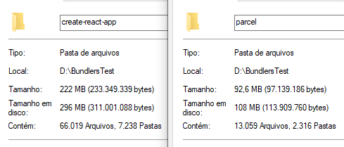

Eu sempre criei meus projetos de React utilizando o [CRA (create-react-app)](https://github.com/facebook/create-react-app), desenvolvido e mantido pelo Facebook, e é uma excelente forma de iniciar projetos rapidamente, sempre atualizados e com suporte a testes, porém, acaba sendo 'muito' para um projeto pequeno, onde eu só quero treinar alguma funcionalidade, aprimorar algum conhecimento ou desenvolver algo simples.

Por exemplo, na minha máquina, um projeto utilizando o CRA consome um **espaço de armazenamento de quase 240mb**. Isso se dá pela quantidade de dependências do projeto e do WebPack (claro, tudo isso com a **pasta node_modules**).


Pensando em poupar meu notebook de sofrer (escutar o barulho do HD e o cooler do CPU acelerando) toda vez que abrisse o VSCode, procurei novas formas de iniciar um projeto React, e foi aí que eu encontrei o [Parcel](https://parceljs.org/getting_started.html).

Parcel é um bundler de aplicações web, bem leve, que se diferencia pelo desempenho, trazendo uma experiência de desenvolver bem interessante e que requer zero configurações.\
**Além disso, se um dia for necessário alterar para o Webpack, é possível.**

Antes de começar, a diferença entre o tamanho das pastas é esta:



Pode não parecer muito, mas quando o computador não é dos melhores ou não tem um SSD, isso influencia bastante.

E para começar um novo projeto com ele é bem simples:

### 1. Instalando o Parcel de forma global:

Isso mesmo, vamos instalar de forma global para que, em novas instâncias de projetos utilizando ele, não seja necessário instala-lo junto com o projeto.

O Parcel, por si próprio tem em **torno de 100mb**, e instalando globalmente no computador, nos poupa de armazenar tudo isso em cada projeto, diminuindo assim, este tamanho para somente **4mb por projeto**.

> *Pode ser instalado em cada projeto também, sem problemas, porém, prefiro assim, visto que o objetivo deste artigo é diminuir o tamanho e aumentar o desempenho.*

```shell
npm install -g parcel
```

### 2. Instalando as dependências:

Será necessário 1) iniciar um novo projeto com o NPM e 2) instalar o React, React-Dom e o Parcel Bundler em cada projeto, para isto:

```shell
npm init -y

npm install react react-dom
npm install -D parcel-bundler
```

### 3. Criando os arquivos para iniciar:

Instalado todas as dependências acima, iremos criar os arquivos para iniciar o projeto.

Para isto, crie um arquivo chamado **'index.html'**, que será o ponto de entrada para o Parcel. Um boilerplate para inicia-lo:

```html
<!DOCTYPE html>
<html lang="en">
  <head>
    <meta charset="utf-8" />
    <meta name="viewport" content="width=device-width, initial-scale=1" />
    <title>React + Parcel</title>
  </head>
  <body>
    <div id="root"></div>
    <script src="index.js"></script>
  </body>
</html>
```

E no mesmo diretório, crie um arquivo onde será contido o ponto de entrada agora para o React, arquivo JavaScript declarado anteriormente no HTML, o **index.js**.

```jsx
import React from "react";
import ReactDOM from "react-dom";

ReactDOM.render(<h1>Hello world!</h1>, document.getElementById("root")); 
```

### 4. Iniciando a aplicação:

Para iniciar, pode ser criado um script de `start` dentro do arquivo `package.json`.

```json
"scripts": {
    "start": "parcel index.html --open"
},
```

Este script irá chamar o `parcel` instalado anteriormente de forma global, com o `index.html` como arquivo para iniciar.

A partir daqui, poderá criar a estrutura de pastas que quiser, sempre cuidando ao declarar a importação do React, onde deve ser passado o `import React from "react";` com o 'R' maiúsculo.

Quaisquer dúvidas, nunca esqueça de consultar a [documentação](https://en.parceljs.org/recipes.html#react)!

- - -

E por hoje é isso, pessoal!

Este é meu primeiro artigo, estou começando, mas gosto de compartilhar novas experiências e principalmente aquelas que podem ajudar ou ensinar as pessoas! Se você leu até aqui, muito obrigado pelo seu tempo.